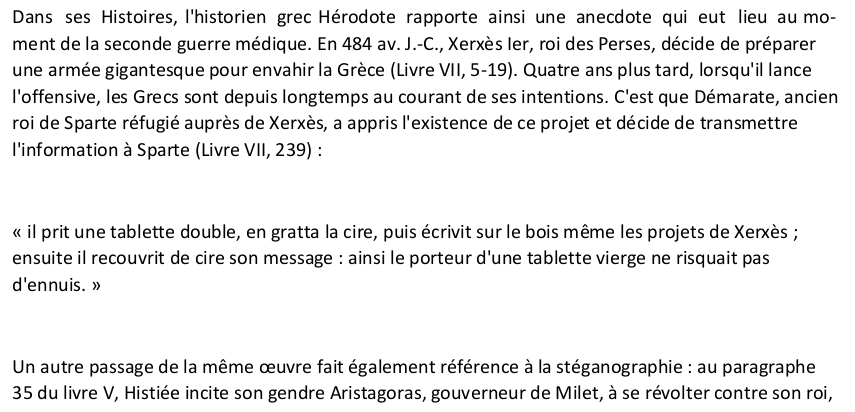

# Nice PDF

#### So we got this file, [NicePDF](files/NicePDF.pdf), and this message :

```
Don't think to much ;)

Format : Hero{}
Author : Thib
```

#### So we open the PDF to see what it contains: 



#### We don't notice anything abnormal at the moment but it's a fairly simple stegano challenge. So we look for "invisible" characters by highlighting the text:


#### We notice characters that replace the spaces, but as they are in white, we don't notice them.

#### So we extract the characters that should not be there and we get :

```
    Hero{E4SY_PDF}
```