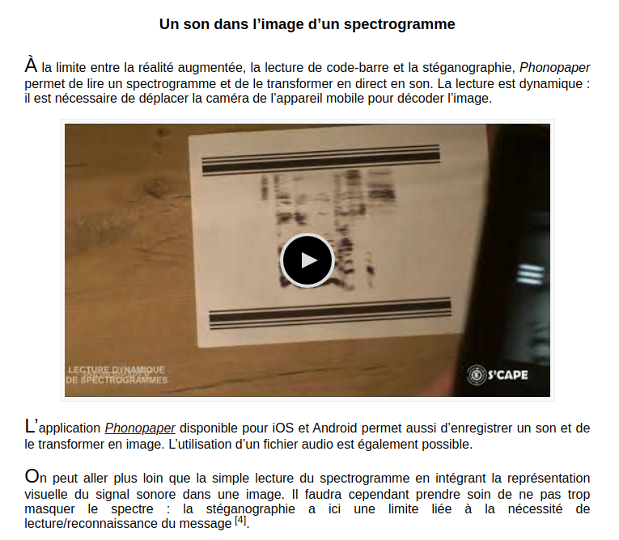

# Phono

#### So we got this file, [whatTheHell](files/whatTheHell.jpg), and this message :

```
Sounds like a melody, no ?

Format : HERO{messageinuppercase}
Author : Thib
```


#### It is clear from the description and the shape of the features of the image that the image represents sound. 

#### By doing some research on the internet, we came across this site: https://scape.enepe.fr/steganographie.html

#### This site tells us about some tools to solve steganography challenges. But one of the tools seems very interesting:



#### So we download the application and test on the image. We get a [sound file](files/extracted_audio.wav), which gives a sequence of characters.

#

#### This gives us the following flag: HERO{PH0N0_P4P3R}
